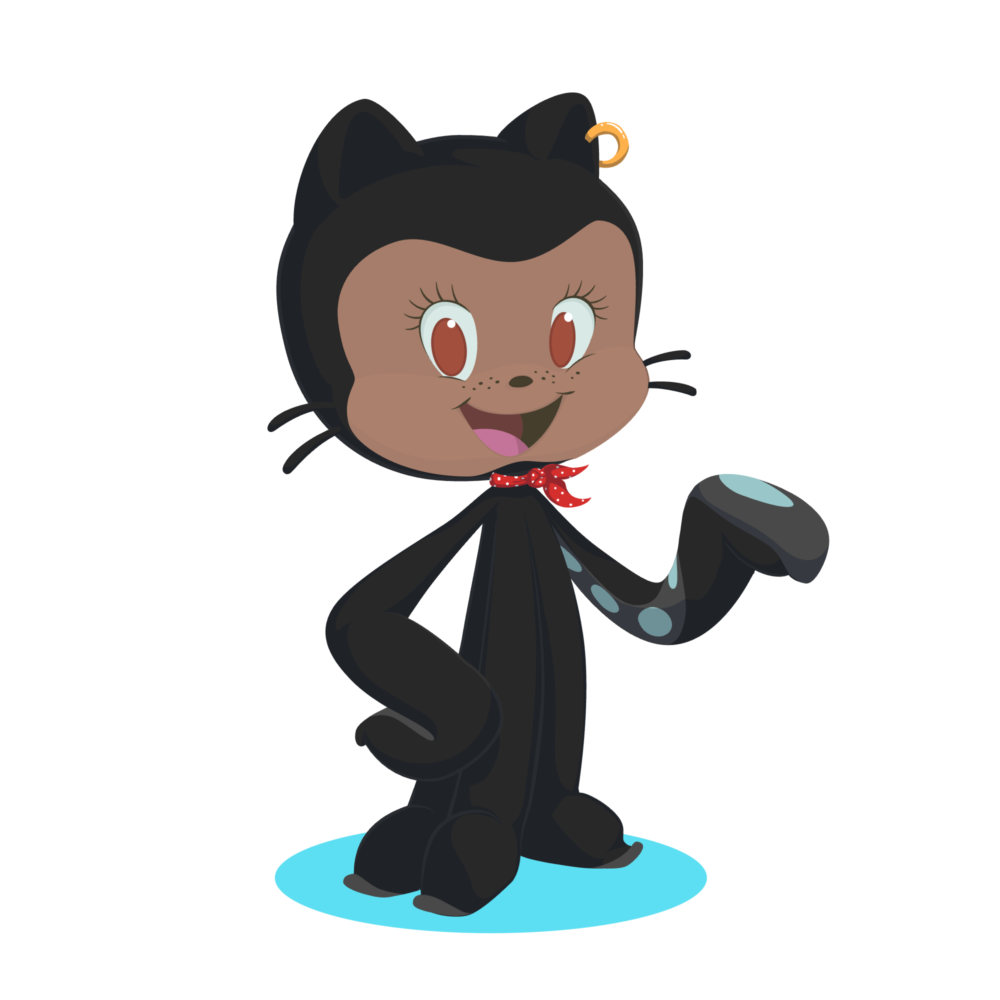

# TDD Workshop

The code snippets for my TDD workshop given on Nov 1st, 2024.

## Short description

The code presented here was written in two ways, without TDD ([badExample](./badExample/)) and with TDD ([goodExample](./goodExample/)). The premise for the code is the following feature request:

> I need a feature that will chat with OpenAI via a file

Each solution implements this feature. There are many advantages to the code presented in the [good example](./goodExample/) over the code presented in the [bad example](./badExample/). To jump start your own thinking while comparing the code, consider this follow up feature request:

> Great! Now make it work for Claude, Gemini, and LLaMa too. Oh, and let users pick which one to use

## Getting started

Fork and/or clone the repo and make sure you have [node](https://nodejs.org/en/learn/getting-started/how-to-install-nodejs) installed, then in the root directory run

`npm install`

### Bad Example

The entry to this piece of code is the `~/demoBad.js` file.

To run this code, use the following command

`npm run start-bad`

To run the tests, use the following command

`npm test ./badExample/badExample.test.js`

### Good Example

The entry to this piece of code is the `~/demoGood.js` file.

To run this code, use the following command

`npm run start-good`

To run the tests, use the following command

`npm test ./goodExample/goodExample.test.js`

## Reaching out

Feel free to open up a [Discussion](https://github.com/jtmcg/tdd-workshop/discussions/new?category=q-a) in the repo to ask me any questions you may have about the workshop or the code.